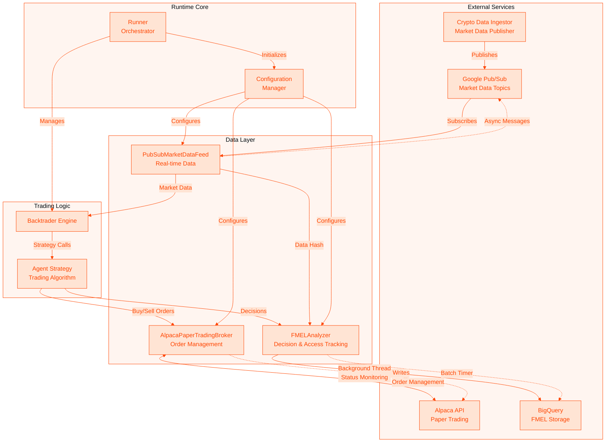

# Trading Runtime

Production-ready algorithmic trading runtime for paper trading with real-time market data and explainability tracking.

## Overview

The Trading Runtime provides a complete infrastructure for running trading agents with:
- **Live Market Data**: Real-time crypto and equity data via Google Pub/Sub
- **Paper Trading**: Alpaca paper trading with portfolio management
- **Explainability**: Foundation Model Explainability Layer (FMEL) tracking all decisions
- **Production Design**: Async order management, graceful shutdown, and robust error handling

## Architecture



## Core Components

### 1. AlpacaPaperTradingBroker (`broker.py`)

**Purpose**: Manages order execution and portfolio state with Alpaca's paper trading API.

**Key Features**:
- **Async Order Monitoring**: Background thread polls order status every 2 seconds
- **Thread-Safe Updates**: Queue-based notification system for order state changes
- **Automatic State Refresh**: Updates portfolio after fills
- **Graceful Shutdown**: Proper cleanup of monitoring threads

**Architecture**:
```python
# Background monitoring pattern
def _monitor_orders(self):
    while not self._stop_monitoring.is_set():
        if self._orders:
            self._update_order_statuses()
        self._stop_monitoring.wait(self.p.poll_interval)
```

**Order Lifecycle**:
1. Strategy calls `buy()` or `sell()`
2. Broker submits to Alpaca API
3. Background thread monitors status
4. State changes queued for Backtrader
5. Portfolio refreshed on fills

### 2. PubSubMarketDataFeed (`data_feed.py`)

**Purpose**: Streams real-time market data from Google Pub/Sub to Backtrader with support for dynamic fields.

**Key Features**:
- **Lock-Free Buffering**: Deque with maxlen for efficient data queuing
- **Auto Subscription Management**: Creates filtered subscriptions per symbol
- **State Transitions**: DELAYED → LIVE → DISCONNECTED lifecycle
- **Content-Addressed Hashing**: Provides data_hash for FMEL tracking
- **Dynamic Fields**: Automatically discovers and exposes news, sentiment, and custom data

**Architecture**:
```python
# Efficient message handling
def _handle_message(self, message):
    data = json.loads(message.data.decode('utf-8'))
    self._data_buffer.append(data)  # Lock-free append

    if self._state == self.DELAYED:
        self._state = self.LIVE
        self.put_notification(self.LIVE)

    message.ack()  # Immediate acknowledgment
```

**Data Flow**:
1. Pub/Sub subscription with symbol filter
2. Async message callback fills buffer
3. `_load()` pops FIFO from buffer
4. Converts to OHLCV for Backtrader
5. Dynamically creates lines for additional fields
6. Stores data_hash for explainability

**Dynamic Fields Support**:

The data feed now automatically discovers and exposes any additional fields in the incoming data:

```python
# Example: Publishing enriched market data with news
publisher = pubsub_v1.PublisherClient()
topic_path = publisher.topic_path(project_id, topic_name)

enriched_data = {
    # Standard OHLCV
    'timestamp': '2024-11-17T14:30:00Z',
    'open': 150.25,
    'high': 151.50,
    'low': 149.75,
    'close': 151.25,
    'volume': 10000,

    # Additional fields automatically available to agents
    'rsi': 65.8,
    'macd': 0.75,
    'sentiment_score': 0.65,
    'news_relevance': 0.8,
    'market_cap': 2450000000000,

    # Nested news data
    'latest_news': {
        'sentiment': 0.75,
        'relevance': 0.9
    }
}

publisher.publish(
    topic_path,
    json.dumps(enriched_data).encode('utf-8'),
    symbol='AAPL'
)
```

Agents can then access these fields naturally:

```python
class Agent(bt.Strategy):
    def next(self):
        for data in self.datas:
            # Standard OHLCV
            close = data.close[0]

            # Dynamic fields
            if hasattr(data.lines, 'sentiment_score'):
                sentiment = data.sentiment_score[0]

            if hasattr(data.lines, 'latest_news_sentiment'):
                news_sentiment = data.latest_news_sentiment[0]

            # Make trading decisions based on all available data
```

### 3. FMELAnalyzer (`fmel_analyzer.py`)

**Purpose**: Memory-efficient tracking of trading decisions with field-level data access for complete explainability.

**Key Features**:
- **Analyzer Pattern**: Uses Backtrader's Analyzer (no historical line storage)
- **Field-Level Tracking**: Records exactly which data fields agents access
- **Direct Order Notifications**: Captures all trading actions with sequence numbers
- **Batch BigQuery Writes**: Groups 10 decisions or 5-second timeout
- **Scalable Design**: Can handle 10,000+ data feeds efficiently

**Architecture**:
```python
class FMELAnalyzer(bt.Analyzer):
    # Direct order tracking - adds to unified event_timeline
    def notify_order(self, order):
        if order.status == order.Completed:
            self._event_timeline.append({
                'event_type': 'TRADE',
                'action': 'BUY' if order.isbuy() else 'SELL',
                'symbol': order.data._name,
                'size': order.executed.size,
                'price': order.executed.price,
                'value': order.executed.value,
                'commission': order.executed.comm,
                'pnl': order.executed.pnl
            })

    # Builds unified timeline from data accesses and trades
    def _build_event_timeline(self, accessed_data):
        # Merges DATA_ACCESS events from access_tracker
        # with TRADE events from notify_order
        # Sorts by timestamp_ns for true chronological order
        # Assigns global sequence numbers
```

**Enhanced Decision Schema**:
```json
{
    "session_id": "chronos-btc-eth-agent_1763498803",
    "agent_id": "chronos-btc-eth-agent",
    "decision_point": 42,
    "timestamp": "2024-11-18T12:00:00Z",
    "bar_time": "2024-11-18T11:59:00Z",
    "stage": "NEXT",
    "action": "TRADED",
    "data_accessed": [
        {
            "symbol": "BTC/USD",
            "data_hash": "abc123",
            "fields_accessed": ["close", "high", "low"],
            "access_patterns": [
                {"seq": 0, "field": "close", "index": 0},
                {"seq": 1, "field": "close", "index": -1}
            ]
        }
    ],
    "event_timeline": [
        {
            "seq": 1,
            "timestamp_ns": 1763498803000000000,
            "event_type": "DATA_ACCESS",
            "symbol": "BTC/USD",
            "field": "close",
            "index": 0,
            "data_hash": "abc123"
        },
        {
            "seq": 2,
            "timestamp_ns": 1763498803000000001,
            "event_type": "DATA_ACCESS",
            "symbol": "BTC/USD",
            "field": "close",
            "index": -1,
            "data_hash": "abc123"
        },
        {
            "seq": 3,
            "timestamp_ns": 1763498803100000000,
            "event_type": "TRADE",
            "symbol": "BTC/USD",
            "action": "BUY",
            "size": 0.05,
            "price": 92500.0,
            "value": 4625.0,
            "commission": 0.0,
            "pnl": null
        }
    ],
    "portfolio_value": 25731.77,
    "portfolio_cash": 629.31
}
```

### 4. Access Tracker (`access_tracker.py`)

**Purpose**: Provides field-level tracking of data access for complete explainability.

**Key Components**:
- **AccessTracker**: Central coordinator for tracking field access
- **AccessTrackingWrapper**: Transparent proxy for data feeds
- **TrackedLine**: Wrapper for individual data lines (OHLC fields)

**How It Works**:
1. Data feeds are wrapped with AccessTrackingWrapper
2. When agents access fields (e.g., `data.close[0]`), the wrapper records:
   - Which field was accessed (close, high, low, volume, etc.)
   - The array index (0 for current, -1 for previous)
   - Timestamp and sequence number
3. FMELAnalyzer collects this data for each decision point

```python
# Example: Agent accessing data triggers tracking
class Agent(bt.Strategy):
    def next(self):
        for data in self.datas:
            close = data.close[0]  # Tracked: field="close", index=0
            prev = data.close[-1]  # Tracked: field="close", index=-1
            high = data.high[0]    # Tracked: field="high", index=0
```

## Configuration

### Quick Setup

```bash
# 1. Copy the template
cp .env.example .env

# 2. Edit with your credentials
nano .env  # or vim .env

# 3. Load environment
source load_env.sh
```

### Environment Variables

#### Required Variables

```bash
# Google Cloud Project
GOOGLE_CLOUD_PROJECT=project-id   # Or use PROJECT_ID

# Agent Configuration
AGENT_ID=my-trading-agent         # Required: unique agent identifier
ALPACA_ACCOUNT_ID=uuid-format     # Required: paper trading account ID

# Redis Configuration (for symbol discovery)
REDIS_HOST=localhost              # Redis server host
REDIS_PORT=6379                   # Redis server port

# Secret Names (provided by Terraform ConfigMap in production)
RUNTIME_API_KEY_NAME=runtime-broker-api-key
RUNTIME_SECRET_KEY_NAME=runtime-broker-secret-key
```

#### Optional Variables

```bash
# Symbol Limits (0 = unlimited, subscribes to ALL available symbols)
MAX_EQUITY_SYMBOLS=0              # Default: 0 (all equities)
MAX_CRYPTO_SYMBOLS=0              # Default: 0 (all crypto)

# FMEL Configuration
FMEL_DATASET=fmel                 # Default: fmel
FMEL_TABLE=decisions_v2           # Default: decisions_v2 (with field tracking)

# Logging
LOG_LEVEL=INFO                    # Default: INFO
```

#### Local Development Variables

```bash
# For local development only - in production, use Secret Manager
ALPACA_API_KEY=PKxxxxxxxxxx       # Broker API key (for local testing)
ALPACA_SECRET_KEY=xxxxxxxxxx      # Broker API secret (for local testing)
```

### Symbol Discovery

The runtime fetches trading symbols dynamically from Redis, which is populated by the asset-discovery service:

```bash
# Redis keys used:
symbols:equities    # List of all tradable equity symbols
symbols:crypto      # List of all tradable crypto symbols

# Symbol limiting for testing:
export MAX_EQUITY_SYMBOLS=10    # Only subscribe to first 10 equities
export MAX_CRYPTO_SYMBOLS=5     # Only subscribe to first 5 crypto pairs

# Default behavior (0 = unlimited):
export MAX_EQUITY_SYMBOLS=0     # Subscribe to ALL available equities
export MAX_CRYPTO_SYMBOLS=0     # Subscribe to ALL available crypto
```

**Important**: The runtime will fail to start if Redis contains no symbols. Ensure the asset-discovery service has run first:

```bash
# Manually trigger asset discovery if needed:
kubectl create job --from=cronjob/equity-asset-refresh equity-manual -n paper-trading
kubectl create job --from=cronjob/crypto-asset-refresh crypto-manual -n paper-trading
```

### Getting Alpaca Credentials

⚠️ **Important**: You need **Broker API** credentials, not Trading API

1. Go to [Alpaca Dashboard](https://app.alpaca.markets/)
2. Navigate to Paper Trading
3. Go to "Account Configuration" → "API Keys"
4. Click "Generate New Key"
5. **Select "Broker" API type** (NOT Trading)
6. Copy API Key, Secret Key, and Account ID

### Configuration Hierarchy

The runtime uses a fallback configuration pattern:
1. Direct environment variables (`ALPACA_API_KEY`)
2. Secret names from environment (`RUNTIME_API_KEY_NAME` → Secret Manager)
3. Google Secret Manager (for production - no hardcoded defaults)
4. Default values (only for optional settings like LOG_LEVEL)

## Running the Runtime

### Prerequisites

```bash
# Install dependencies matching backtesting container
pip install -r requirements.txt

# Required versions for compatibility:
# numpy==1.26.4
# torch==2.9.1
# transformers==4.57.1
# huggingface-hub==0.36.0
# chronos-forecasting==2.0.1
```

### Local Development

```bash
# Ensure Redis is running and populated with symbols
redis-cli get symbols:equities  # Should return JSON array of symbols
redis-cli get symbols:crypto    # Should return JSON array of crypto pairs

# Load environment
source load_env.sh

# Run with ALL available symbols (default)
python runner.py

# Run with limited symbols for testing
export MAX_EQUITY_SYMBOLS=10
export MAX_CRYPTO_SYMBOLS=5
python runner.py

# For local testing without Secret Manager:
export ALPACA_API_KEY="your-broker-api-key"
export ALPACA_SECRET_KEY="your-broker-secret-key"
python runner.py
```

### Docker Deployment

```bash
# Build image
docker build -t trading-runtime .

# Run container
docker run --env-file .env trading-runtime
```

### Kubernetes Deployment

```bash
# Apply configuration
kubectl apply -f k8s.yaml

# Check status
kubectl get pods -l app=trading-agent
kubectl logs -l app=trading-agent -f
```

## Data Flow Lifecycle

### 1. Market Data Pipeline
```
Crypto Exchange → Ingestor → Pub/Sub → Subscription → DataFeed → Backtrader
```

### 2. Trading Decision Pipeline
```
Backtrader → Agent.next() → Prediction → Buy/Sell → Broker → Alpaca API
```

### 3. Explainability Pipeline
```
Agent Decision + Market Hash + Portfolio State → FMEL → Batch → BigQuery
```

## Production Features

### Graceful Shutdown
- Signal handlers for SIGINT/SIGTERM
- Broker thread cleanup
- Data feed subscription deletion
- FMEL batch flush
- Final portfolio reporting

### Error Recovery
- Automatic reconnection for Pub/Sub
- Order status retry with exponential backoff
- BigQuery insert error logging
- Portfolio refresh on failures

### Performance Optimization
- Lock-free data buffering
- Batch BigQuery writes
- Async order monitoring
- Parallel feed initialization
- Efficient OHLCV conversion

## Monitoring

### Logs
```bash
# View runtime logs
tail -f runtime.log

# Filter by component
grep "broker" runtime.log
grep "data_feed" runtime.log
grep "fmel_observer" runtime.log
```

### Metrics
- **Portfolio**: Value, cash, P&L tracking
- **Orders**: Submission, fill, rejection counts
- **Data**: Messages received/processed per feed
- **FMEL**: Decisions recorded, batch sizes

### BigQuery Analysis
```sql
-- View recent decisions
SELECT
  timestamp,
  agent_id,
  action,
  portfolio_value,
  ARRAY_LENGTH(positions) as position_count
FROM `project.fmel.decisions_v2`
WHERE session_id = 'agent_123_1699564800'
ORDER BY timestamp DESC
LIMIT 100;

-- Analyze trading patterns
SELECT
  action,
  COUNT(*) as count,
  AVG(portfolio_value) as avg_value
FROM `project.fmel.decisions_v2`
GROUP BY action;
```

## Troubleshooting

### Common Issues

**No Symbols Found**:
- Ensure Redis is accessible at configured host:port
- Verify asset-discovery service has run successfully
- Check Redis keys: `redis-cli get symbols:equities`
- Manual trigger: `kubectl create job --from=cronjob/equity-asset-refresh equity-manual -n paper-trading`

**Secret Manager Access Denied**:
- Verify secret names are provided via environment variables
- Check service account has `secretAccessor` role
- Ensure secrets exist in Secret Manager
- For local dev, use direct ALPACA_API_KEY/ALPACA_SECRET_KEY

**No Market Data**:
- Check data-ingestors are running (both equity and crypto)
- Verify Pub/Sub subscription filters
- Ensure symbols match exactly (e.g., "BTC/USD" not "BTC-USD")
- Check Redis has symbols that match what ingestors are streaming

**Order Failures**:
- Verify Alpaca account is funded
- Check API credentials are for Broker API (not Trading API)
- Review broker logs for rejection reasons
- Ensure using paper trading sandbox endpoints

**FMEL Not Recording**:
- Verify BigQuery dataset/table exists
- Check service account permissions
- Review batch timer logs
- Ensure decisions_v2 table schema includes field tracking

**Library Compatibility**:
- Match exact versions from backtesting container
- Use Python 3.10+ for chronos-forecasting 2.0+
- Check dtype parameter handling in agent

## Development

### Testing Components

```python
# Test broker connection
from broker import AlpacaPaperTradingBroker
broker = AlpacaPaperTradingBroker(
    api_key="KEY",
    secret_key="SECRET",
    account_id="ID",
    sandbox=True
)
print(f"Balance: ${broker.getcash():,.2f}")

# Test data feed
from data_feed import PubSubMarketDataFeed
feed = PubSubMarketDataFeed(
    project_id="project",
    topic_name="crypto-data",
    symbol="BTC/USD"
)
feed.start()

# Test FMEL
from fmel_observer import FMELObserver
observer = FMELObserver()
observer._record_observation("TEST", "HOLD")
```

### Adding New Features

**New Order Types**:
1. Extend `_submit_order()` in broker.py
2. Add order type mapping
3. Update status monitoring

**Additional Data Sources**:
1. Create new DataFeed subclass
2. Implement `_load()` method
3. Add to runner configuration

**Enhanced Explainability**:
1. Extend decision schema
2. Update `_record_observation()`
3. Modify BigQuery table schema

## License

Proprietary - Spooky Labs

## Support

For issues or questions:
- Review logs in runtime directory
- Check BigQuery for FMEL decisions
- Verify environment configuration
- Ensure library version compatibility

---

Made with 🌲🌲🌲 in Cascadia