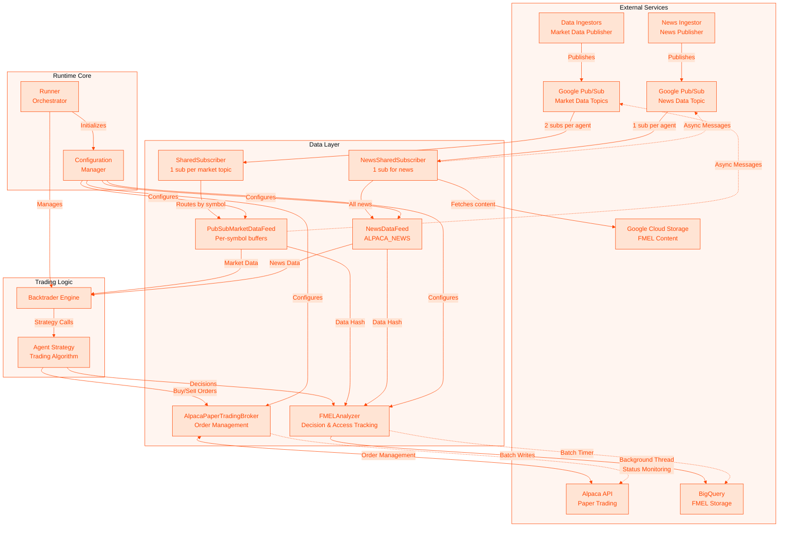

# Trading Runtime

Production-ready algorithmic trading runtime for paper trading with real-time market data and explainability tracking.

## Overview

The Trading Runtime provides a complete infrastructure for running trading agents with:
- **Live Market Data**: Real-time crypto and equity data via Google Pub/Sub
- **Live News Data**: Real-time news with text lookback support (`news.headline[-1]`)
- **Paper Trading**: Alpaca paper trading with portfolio management
- **Explainability**: Foundation Model Explainability Layer (FMEL) tracking all decisions
- **Production Design**: Async order management, graceful shutdown, and robust error handling

## Architecture



## Core Components

### 1. AlpacaPaperTradingBroker (`broker.py`)

**Purpose**: Manages order execution and portfolio state with Alpaca's paper trading API.

**Key Features**:
- **Async Order Monitoring**: Background thread polls order status every 2 seconds
- **Thread-Safe Updates**: Queue-based notification system for order state changes
- **Automatic State Refresh**: Updates portfolio after fills
- **Graceful Shutdown**: Proper cleanup of monitoring threads

**Architecture**:
```python
# Background monitoring pattern
def _monitor_orders(self):
    while not self._stop_monitoring.is_set():
        if self._orders:
            self._update_order_statuses()
        self._stop_monitoring.wait(self.p.poll_interval)
```

**Order Lifecycle**:
1. Strategy calls `buy()` or `sell()`
2. Broker submits to Alpaca API
3. Background thread monitors status
4. State changes queued for Backtrader
5. Portfolio refreshed on fills

### 2. SharedSubscriber (`shared_subscriber.py`)

**Purpose**: Manages shared Pub/Sub subscriptions to reduce quota usage from O(symbols × agents) to O(topics × agents).

**Why This Pattern Exists**:
- Pub/Sub has a hard limit of **10,000 subscriptions per topic per project**
- Old pattern: 70 subscriptions per agent (one per symbol)
- New pattern: 2 subscriptions per agent (one per topic: market-data + crypto-data)
- Result: Supports **5,000 agents** instead of ~140

**Key Features**:
- **Singleton Per Topic**: One SharedSubscriber instance per (project, topic, agent_id)
- **Symbol Routing**: Routes messages to correct feed buffers based on `symbol` field
- **Thread-Safe Buffering**: Caches deque references to avoid Backtrader's `__getattribute__`
- **Auto Cleanup**: Deletes subscriptions on graceful shutdown (prevents orphans)

**Architecture**:
```python
# Registration (on main thread) - cache buffer reference
def register_feed(self, symbol: str, feed: object):
    with self._feeds_lock:
        self.feeds[symbol] = feed
        self.buffers[symbol] = feed._data_buffer  # Cache deque NOW

# Message handling (on Pub/Sub thread) - no Backtrader access
def _handle_message(self, message):
    data = json.loads(message.data.decode('utf-8'))
    symbol = data.get('symbol')

    with self._feeds_lock:
        buffer = self.buffers.get(symbol)  # Get cached deque

    if buffer is not None:
        buffer.append(data)  # Direct deque append (thread-safe)

    message.ack()
```

**Subscription Naming**:
```
agent-{agent_id}-{topic_name}
Examples:
  agent-a1b2c3d4-market-data
  agent-a1b2c3d4-crypto-data
```

**Thread Safety Critical Detail**:
Backtrader's `__getattribute__` accesses internal arrays for ANY attribute access on feed objects. Even accessing `feed._data_buffer` from a background thread triggers this machinery and causes "array index out of range" errors. The solution is to cache the `collections.deque` reference at registration time (on the main thread) so the callback thread only accesses the cached deque directly.

### 3. PubSubMarketDataFeed (`data_feed.py`)

**Purpose**: Streams real-time market data from Google Pub/Sub to Backtrader with support for dynamic fields.

**Key Features**:
- **Lock-Free Buffering**: Deque with maxlen for efficient data queuing
- **SharedSubscriber Integration**: Registers with SharedSubscriber instead of creating per-symbol subscriptions
- **State Transitions**: DELAYED → LIVE → DISCONNECTED lifecycle
- **Content-Addressed Hashing**: Provides data_hash for FMEL tracking
- **Dynamic Fields**: Automatically discovers and exposes news, sentiment, and custom data

**Architecture**:
```python
# Feed registers with SharedSubscriber
def start(self):
    subscriber = SharedSubscriber.get_instance(
        self.project_id, self.topic_name, self.agent_id
    )
    subscriber.register_feed(self.symbol, self)
```

**Data Flow**:
1. Feed registers with SharedSubscriber by symbol
2. SharedSubscriber routes messages to feed's buffer
3. `_load()` pops FIFO from buffer
4. Converts to OHLCV for Backtrader
5. Dynamically creates lines for additional fields
6. Stores data_hash for explainability

**Dynamic Fields Support**:

The data feed now automatically discovers and exposes any additional fields in the incoming data:

```python
# Example: Publishing enriched market data with news
publisher = pubsub_v1.PublisherClient()
topic_path = publisher.topic_path(project_id, topic_name)

enriched_data = {
    # Standard OHLCV
    'timestamp': '2024-11-17T14:30:00Z',
    'open': 150.25,
    'high': 151.50,
    'low': 149.75,
    'close': 151.25,
    'volume': 10000,

    # Additional fields automatically available to agents
    'rsi': 65.8,
    'macd': 0.75,
    'sentiment_score': 0.65,
    'news_relevance': 0.8,
    'market_cap': 2450000000000,

    # Nested news data
    'latest_news': {
        'sentiment': 0.75,
        'relevance': 0.9
    }
}

publisher.publish(
    topic_path,
    json.dumps(enriched_data).encode('utf-8'),
    symbol='AAPL'
)
```

Agents can then access these fields naturally:

```python
class Agent(bt.Strategy):
    def next(self):
        for data in self.datas:
            # Standard OHLCV
            close = data.close[0]

            # Dynamic fields
            if hasattr(data.lines, 'sentiment_score'):
                sentiment = data.sentiment_score[0]

            if hasattr(data.lines, 'latest_news_sentiment'):
                news_sentiment = data.latest_news_sentiment[0]

            # Make trading decisions based on all available data
```

### 4. NewsDataFeed (`news_data_feed.py`)

**Purpose**: Streams real-time news from Google Pub/Sub to Backtrader with text lookback support.

**Key Features**:
- **Standard OHLCV Lines**: Zeros for plotting/observer compatibility
- **News Numeric Lines**: `news_id`, `created_at_ts`, `updated_at_ts`, `symbol_count`
- **Text Lookback**: Access previous articles via `news.headline[-1]`, `news.symbols[-2]`, etc.
- **FMEL Integration**: Each text access records the correct `data_hash` for that article

**Architecture**:
```
Pub/Sub (news-data topic)
        │
        ▼
NewsSharedSubscriber (1 sub per agent)
  - Fetches full content from GCS via data_hash
  - Caches content to avoid duplicate fetches
        │
        ▼
NewsDataFeed (ALPACA_NEWS)
  - Numeric lines for Backtrader indexing
  - _text_history list for text lookback
```

**Text Lookback Design**:

Since Backtrader lines only store floats, text content is stored in `_text_history`:

```python
# As articles arrive, _text_history grows (newest at end):
# [article1, article2, article3]
#  ↑ oldest              ↑ newest

# Backtrader indexing conversion:
# [0]  = current  → _text_history[-1]
# [-1] = previous → _text_history[-2]

# Formula: abs_idx = len(_text_history) - 1 + backtrader_idx
```

**Agent Usage**:
```python
class Agent(bt.Strategy):
    def __init__(self):
        self.news = self.getdatabyname('ALPACA_NEWS')

    def next(self):
        # Skip news in market data loop
        for d in self.datas:
            if d._name == 'ALPACA_NEWS':
                continue
            # ... market trading logic

        # Process news
        if len(self.news) > 0:
            # Current article
            headline = self.news.headline[0]
            symbols = self.news.symbols[0]  # Returns List[str]

            # Previous article (lookback)
            if len(self.news) > 1:
                prev_headline = self.news.headline[-1]

            # Numeric fields
            news_id = self.news.news_id[0]
            created_ts = self.news.created_at_ts[0]

            # React to news
            for symbol in symbols:
                if symbol in [d._name for d in self.datas]:
                    market_data = self.getdatabyname(symbol)
                    if 'earnings beat' in headline.lower():
                        self.buy(data=market_data, size=10)
```

**Text Fields Available**:
| Field | Type | Description |
|-------|------|-------------|
| `headline` | string | Article headline |
| `summary` | string | Article summary |
| `content` | string | Full article content |
| `author` | string | Article author |
| `url` | string | Article URL |
| `source` | string | News source (e.g., Benzinga) |
| `symbols` | List[str] | Related/mentioned symbols |

**Numeric Lines**:
| Line | Type | Description |
|------|------|-------------|
| `news_id` | int | Article ID |
| `created_at_ts` | float | Unix timestamp of creation |
| `updated_at_ts` | float | Unix timestamp of last update |
| `symbol_count` | int | Number of symbols mentioned |

### 5. FMELAnalyzer (`fmel_analyzer.py`)

**Purpose**: Memory-efficient tracking of trading decisions with field-level data access for complete explainability.

**Key Features**:
- **Analyzer Pattern**: Uses Backtrader's Analyzer (no historical line storage)
- **Field-Level Tracking**: Records exactly which data fields agents access
- **Direct Order Notifications**: Captures all trading actions with sequence numbers
- **Batch BigQuery Writes**: Groups 10 decisions or 5-second timeout
- **Scalable Design**: Can handle 10,000+ data feeds efficiently

**Architecture**:
```python
class FMELAnalyzer(bt.Analyzer):
    # Direct order tracking - adds to unified event_timeline
    def notify_order(self, order):
        if order.status == order.Completed:
            self._event_timeline.append({
                'event_type': 'TRADE',
                'action': 'BUY' if order.isbuy() else 'SELL',
                'symbol': order.data._name,
                'size': order.executed.size,
                'price': order.executed.price,
                'value': order.executed.value,
                'commission': order.executed.comm,
                'pnl': order.executed.pnl
            })

    # Builds unified timeline from data accesses and trades
    def _build_event_timeline(self, accessed_data):
        # Merges DATA_ACCESS events from access_tracker
        # with TRADE events from notify_order
        # Sorts by timestamp_ns for true chronological order
        # Assigns global sequence numbers
```

**Enhanced Decision Schema**:
```json
{
    "session_id": "chronos-btc-eth-agent_1763498803",
    "agent_id": "chronos-btc-eth-agent",
    "decision_point": 42,
    "timestamp": "2024-11-18T12:00:00Z",
    "bar_time": "2024-11-18T11:59:00Z",
    "stage": "NEXT",
    "action": "TRADED",
    "data_accessed": [
        {
            "symbol": "BTC/USD",
            "data_hash": "abc123",
            "fields_accessed": ["close", "high", "low"],
            "access_patterns": [
                {"seq": 0, "field": "close", "index": 0},
                {"seq": 1, "field": "close", "index": -1}
            ]
        }
    ],
    "event_timeline": [
        {
            "seq": 1,
            "timestamp_ns": 1763498803000000000,
            "event_type": "DATA_ACCESS",
            "symbol": "BTC/USD",
            "field": "close",
            "index": 0,
            "data_hash": "abc123"
        },
        {
            "seq": 2,
            "timestamp_ns": 1763498803000000001,
            "event_type": "DATA_ACCESS",
            "symbol": "BTC/USD",
            "field": "close",
            "index": -1,
            "data_hash": "abc123"
        },
        {
            "seq": 3,
            "timestamp_ns": 1763498803100000000,
            "event_type": "TRADE",
            "symbol": "BTC/USD",
            "action": "BUY",
            "size": 0.05,
            "price": 92500.0,
            "value": 4625.0,
            "commission": 0.0,
            "pnl": null
        }
    ],
    "portfolio_value": 25731.77,
    "portfolio_cash": 629.31
}
```

### 6. Access Tracker (`access_tracker.py`)

**Purpose**: Provides field-level tracking of data access for complete explainability, including news lookback.

**Key Components**:
- **AccessTracker**: Central coordinator for tracking field access
- **AccessTrackingWrapper**: Transparent proxy for data feeds
- **TrackedLine**: Wrapper for market data lines (OHLCV fields)
- **TrackedTextAccessor**: Wrapper for news text fields with hash lookup for lookback
- **TrackedNewsLine**: Wrapper for news numeric lines with hash lookup for lookback

**How It Works**:

For market data:
1. Data feeds are wrapped with AccessTrackingWrapper
2. When agents access fields (e.g., `data.close[0]`), the wrapper records:
   - Which field was accessed (close, high, low, volume, etc.)
   - The array index (0 for current, -1 for previous)
   - Timestamp and sequence number
3. FMELAnalyzer collects this data for each decision point

For news data with lookback:
1. When agent accesses `news.headline[-1]`, TrackedTextAccessor:
   - Looks up the `data_hash` for THAT specific article (not current)
   - Records the field, index, and correct hash
2. This enables full traceability: "Agent looked at previous article (hash: abc123)"

```python
# Market data tracking
class Agent(bt.Strategy):
    def next(self):
        for data in self.datas:
            close = data.close[0]  # Tracked: field="close", index=0
            prev = data.close[-1]  # Tracked: field="close", index=-1

        # News data tracking (with correct hash for each lookback position)
        news = self.getdatabyname('ALPACA_NEWS')
        headline = news.headline[0]   # Tracked: field="headline", index=0, hash=current
        prev = news.headline[-1]      # Tracked: field="headline", index=-1, hash=previous
```

**FMEL Record Example**:
```json
{
  "data_accessed": [
    {
      "symbol": "ALPACA_NEWS",
      "fields_accessed": ["headline"],
      "access_patterns": [
        {"seq": 0, "field": "headline", "index": 0, "data_hash": "abc123"},
        {"seq": 1, "field": "headline", "index": -1, "data_hash": "xyz789"}
      ]
    }
  ]
}
```

## Configuration

### Quick Setup

```bash
# 1. Copy the template
cp .env.example .env

# 2. Edit with your credentials
nano .env  # or vim .env

# 3. Load environment
source load_env.sh
```

### Environment Variables

#### Required Variables

```bash
# Google Cloud Project
GOOGLE_CLOUD_PROJECT=project-id   # Or use PROJECT_ID

# Agent Configuration
AGENT_ID=my-trading-agent         # Required: unique agent identifier
ALPACA_ACCOUNT_ID=uuid-format     # Required: paper trading account ID

# Redis Configuration (for symbol discovery)
REDIS_HOST=localhost              # Redis server host
REDIS_PORT=6379                   # Redis server port

# Secret Names (provided by Terraform ConfigMap in production)
RUNTIME_BROKER_API_KEY_NAME=runtime-broker-api-key
RUNTIME_BROKER_SECRET_KEY_NAME=runtime-broker-secret-key
```

#### Optional Variables

```bash
# Symbol Limits (0 = unlimited, subscribes to ALL available symbols)
MAX_EQUITY_SYMBOLS=0              # Default: 0 (all equities)
MAX_CRYPTO_SYMBOLS=0              # Default: 0 (all crypto)

# FMEL Configuration
FMEL_DATASET=fmel                 # Default: fmel
FMEL_TABLE=decisions              # Default: decisions

# Logging
LOG_LEVEL=INFO                    # Default: INFO
```

#### Local Development Variables

```bash
# For local development only - in production, use Secret Manager
ALPACA_API_KEY=PKxxxxxxxxxx       # Broker API key (for local testing)
ALPACA_SECRET_KEY=xxxxxxxxxx      # Broker API secret (for local testing)
```

### Symbol Discovery

The runtime fetches trading symbols dynamically from Redis, which is populated by the asset-discovery service:

```bash
# Redis keys used:
symbols:equities    # List of all tradable equity symbols
symbols:crypto      # List of all tradable crypto symbols

# Symbol limiting for testing:
export MAX_EQUITY_SYMBOLS=10    # Only subscribe to first 10 equities
export MAX_CRYPTO_SYMBOLS=5     # Only subscribe to first 5 crypto pairs

# Default behavior (0 = unlimited):
export MAX_EQUITY_SYMBOLS=0     # Subscribe to ALL available equities
export MAX_CRYPTO_SYMBOLS=0     # Subscribe to ALL available crypto
```

**Important**: The runtime will fail to start if Redis contains no symbols. Ensure the asset-discovery service has run first:

```bash
# Manually trigger asset discovery if needed:
kubectl create job --from=cronjob/equity-asset-refresh equity-manual -n paper-trading
kubectl create job --from=cronjob/crypto-asset-refresh crypto-manual -n paper-trading
```

### Getting Alpaca Credentials

⚠️ **Important**: You need **Broker API** credentials, not Trading API

1. Go to [Alpaca Dashboard](https://app.alpaca.markets/)
2. Navigate to Paper Trading
3. Go to "Account Configuration" → "API Keys"
4. Click "Generate New Key"
5. **Select "Broker" API type** (NOT Trading)
6. Copy API Key, Secret Key, and Account ID

### Configuration Hierarchy

The runtime uses a fallback configuration pattern:
1. Direct environment variables (`ALPACA_API_KEY`)
2. Secret names from environment (`RUNTIME_API_KEY_NAME` → Secret Manager)
3. Google Secret Manager (for production - no hardcoded defaults)
4. Default values (only for optional settings like LOG_LEVEL)

## Running the Runtime

### Prerequisites

```bash
# Install dependencies matching backtesting container
pip install -r requirements.txt

# Required versions for compatibility:
# numpy==1.26.4
# torch==2.9.1
# transformers==4.57.1
# huggingface-hub==0.36.0
# chronos-forecasting==2.0.1
```

### Local Development

```bash
# Ensure Redis is running and populated with symbols
redis-cli get symbols:equities  # Should return JSON array of symbols
redis-cli get symbols:crypto    # Should return JSON array of crypto pairs

# Load environment
source load_env.sh

# Run with ALL available symbols (default)
python runner.py

# Run with limited symbols for testing
export MAX_EQUITY_SYMBOLS=10
export MAX_CRYPTO_SYMBOLS=5
python runner.py

# For local testing without Secret Manager:
export ALPACA_API_KEY="your-broker-api-key"
export ALPACA_SECRET_KEY="your-broker-secret-key"
python runner.py
```

### Docker Deployment

```bash
# Build image
docker build -t trading-runtime .

# Run container
docker run --env-file .env trading-runtime
```

### Kubernetes Deployment

```bash
# Apply configuration
kubectl apply -f k8s.yaml

# Check status
kubectl get pods -l app=trading-agent
kubectl logs -l app=trading-agent -f
```

## Data Flow Lifecycle

### 1. Market Data Pipeline
```
Exchange → Ingestor → Pub/Sub Topic → SharedSubscriber (2 subs/agent) → Routes by symbol → DataFeed Buffers → Backtrader
```

### 2. News Data Pipeline
```
Alpaca News → News Ingestor → Pub/Sub (news-data) → NewsSharedSubscriber (1 sub/agent) → GCS Fetch → NewsDataFeed → Backtrader
```

### 3. Trading Decision Pipeline
```
Backtrader → Agent.next() → Prediction → Buy/Sell → Broker → Alpaca API
```

### 4. Explainability Pipeline
```
Agent Decision + Market/News Hash + Portfolio State → FMEL → Batch → BigQuery
```

## Production Features

### Graceful Shutdown
- Signal handlers for SIGINT/SIGTERM
- Broker thread cleanup
- Data feed unregistration from SharedSubscriber
- SharedSubscriber deletes Pub/Sub subscriptions (prevents orphans)
- FMEL batch flush to BigQuery
- Final portfolio reporting

### Error Recovery
- Automatic reconnection for Pub/Sub
- Order status retry with exponential backoff
- BigQuery insert error logging
- Portfolio refresh on failures

### Performance Optimization
- Lock-free data buffering
- Batch BigQuery writes
- Async order monitoring
- Parallel feed initialization
- Efficient OHLCV conversion

## Monitoring

### Logs
```bash
# View runtime logs
tail -f runtime.log

# Filter by component
grep "broker" runtime.log
grep "data_feed" runtime.log
grep "fmel_observer" runtime.log
```

### Metrics
- **Portfolio**: Value, cash, P&L tracking
- **Orders**: Submission, fill, rejection counts
- **Data**: Messages received/processed per feed
- **FMEL**: Decisions recorded, batch sizes

### BigQuery Analysis
```sql
-- View recent decisions
SELECT
  timestamp,
  agent_id,
  action,
  portfolio_value,
  ARRAY_LENGTH(positions) as position_count
FROM `project.fmel.decisions`
WHERE session_id = 'agent_123_1699564800'
ORDER BY timestamp DESC
LIMIT 100;

-- Analyze trading patterns
SELECT
  action,
  COUNT(*) as count,
  AVG(portfolio_value) as avg_value
FROM `project.fmel.decisions`
GROUP BY action;
```

## Troubleshooting

### Common Issues

**No Symbols Found**:
- Ensure Redis is accessible at configured host:port
- Verify asset-discovery service has run successfully
- Check Redis keys: `redis-cli get symbols:equities`
- Manual trigger: `kubectl create job --from=cronjob/equity-asset-refresh equity-manual -n paper-trading`

**Secret Manager Access Denied**:
- Verify secret names are provided via environment variables
- Check service account has `secretAccessor` role
- Ensure secrets exist in Secret Manager
- For local dev, use direct ALPACA_API_KEY/ALPACA_SECRET_KEY

**No Market Data**:
- Check data-ingestors are running (both equity and crypto)
- Verify Pub/Sub subscription filters
- Ensure symbols match exactly (e.g., "BTC/USD" not "BTC-USD")
- Check Redis has symbols that match what ingestors are streaming

**Order Failures**:
- Verify Alpaca account is funded
- Check API credentials are for Broker API (not Trading API)
- Review broker logs for rejection reasons
- Ensure using paper trading sandbox endpoints

**FMEL Not Recording**:
- Verify BigQuery dataset/table exists (`fmel.decisions`)
- Check service account permissions
- Review batch timer logs
- Common error: 404 on BigQuery means table name mismatch (use `decisions` not `decisions_v2`)

**SharedSubscriber Errors**:
- "array index out of range" = Backtrader attribute accessed from callback thread
  - Fix: Ensure buffer references are cached at registration time, not in callback
- Subscription quota exhausted = Too many orphaned subscriptions
  - Clean up: `gcloud pubsub subscriptions list | grep 'feed-' | xargs -P 20 -I {} gcloud pubsub subscriptions delete {}`

**News Data Feed Issues**:
- No news arriving:
  - Check news-data Pub/Sub topic has messages
  - Verify NewsSharedSubscriber subscription exists: `gcloud pubsub subscriptions list | grep news-data`
  - Check FMEL_BUCKET environment variable is set correctly
- Empty text fields:
  - Verify GCS bucket has article content at `data_hash` paths
  - Check NewsFMELFetcher logs for fetch errors
- News lookback returning empty strings:
  - `len(news.headline)` returns number of articles in history
  - `text_history_size` param controls how many articles are kept (default: 1000)

**Library Compatibility**:
- Match exact versions from backtesting container
- Use Python 3.10+ for chronos-forecasting 2.0+
- Check dtype parameter handling in agent

## Development

### Testing Components

```python
# Test broker connection
from broker import AlpacaPaperTradingBroker
broker = AlpacaPaperTradingBroker(
    api_key="KEY",
    secret_key="SECRET",
    account_id="ID",
    sandbox=True
)
print(f"Balance: ${broker.getcash():,.2f}")

# Test data feed
from data_feed import PubSubMarketDataFeed
feed = PubSubMarketDataFeed(
    project_id="project",
    topic_name="crypto-data",
    symbol="BTC/USD"
)
feed.start()

# Test FMEL
from fmel_observer import FMELObserver
observer = FMELObserver()
observer._record_observation("TEST", "HOLD")
```

### Adding New Features

**New Order Types**:
1. Extend `_submit_order()` in broker.py
2. Add order type mapping
3. Update status monitoring

**Additional Data Sources**:
1. Create new DataFeed subclass
2. Implement `_load()` method
3. Add to runner configuration

**Enhanced Explainability**:
1. Extend decision schema
2. Update `_record_observation()`
3. Modify BigQuery table schema

## License

Proprietary - Spooky Labs

## Support

For issues or questions:
- Review logs in runtime directory
- Check BigQuery for FMEL decisions
- Verify environment configuration
- Ensure library version compatibility

---

Made with 🌲🌲🌲 in Cascadia